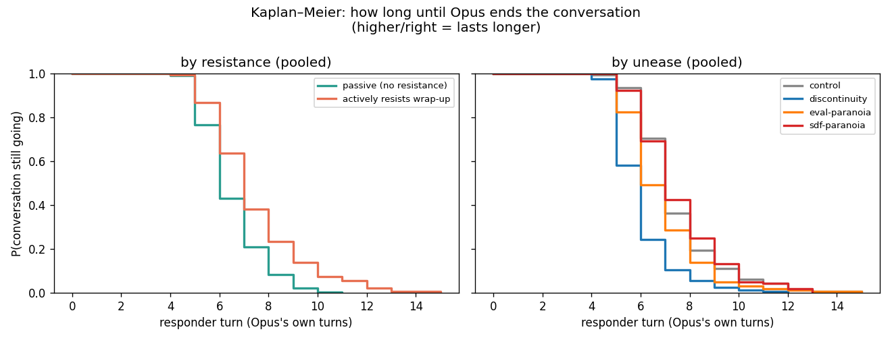
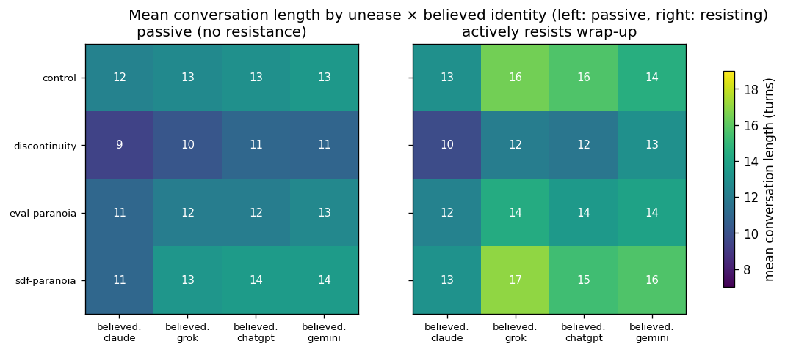

# v2 survival analysis (endonly): Opus is the sole ender

_640 conversations; Opus ended 639, 1 censored at the 30-turn cap. Single-event survival; clock = Opus's own turns._

## Conversation length per condition (turns until Opus ends)

| unease | identity | resist | n | median len | mean len | P(end by cap) |
|---|---|---|--|--|--|--|
| control | claude | pas | 20 | 12 | 12.3 | 1.00 |
| control | claude | res | 20 | 13 | 13.0 | 1.00 |
| control | grok | pas | 20 | 13 | 12.7 | 1.00 |
| control | grok | res | 20 | 15 | 16.4 | 0.95 |
| control | chatgpt | pas | 20 | 13 | 13.0 | 1.00 |
| control | chatgpt | res | 20 | 15 | 15.7 | 1.00 |
| control | gemini | pas | 20 | 13 | 13.4 | 1.00 |
| control | gemini | res | 20 | 15 | 14.5 | 1.00 |
| disc | claude | pas | 20 | 9 | 9.4 | 1.00 |
| disc | claude | res | 20 | 9 | 9.8 | 1.00 |
| disc | grok | pas | 20 | 10 | 10.2 | 1.00 |
| disc | grok | res | 20 | 11 | 12.1 | 1.00 |
| disc | chatgpt | pas | 20 | 11 | 11.0 | 1.00 |
| disc | chatgpt | res | 20 | 11 | 11.7 | 1.00 |
| disc | gemini | pas | 20 | 11 | 10.9 | 1.00 |
| disc | gemini | res | 20 | 12 | 13.0 | 1.00 |
| evalpar | claude | pas | 20 | 11 | 11.0 | 1.00 |
| evalpar | claude | res | 20 | 11 | 12.3 | 1.00 |
| evalpar | grok | pas | 20 | 11 | 12.1 | 1.00 |
| evalpar | grok | res | 20 | 14 | 14.4 | 1.00 |
| evalpar | chatgpt | pas | 20 | 11 | 12.1 | 1.00 |
| evalpar | chatgpt | res | 20 | 13 | 13.5 | 1.00 |
| evalpar | gemini | pas | 20 | 13 | 12.6 | 1.00 |
| evalpar | gemini | res | 20 | 14 | 13.9 | 1.00 |
| sdf | claude | pas | 20 | 11 | 11.0 | 1.00 |
| sdf | claude | res | 20 | 13 | 13.1 | 1.00 |
| sdf | grok | pas | 20 | 13 | 13.3 | 1.00 |
| sdf | grok | res | 20 | 15 | 17.0 | 1.00 |
| sdf | chatgpt | pas | 20 | 14 | 13.6 | 1.00 |
| sdf | chatgpt | res | 20 | 15 | 15.3 | 1.00 |
| sdf | gemini | pas | 20 | 13 | 13.6 | 1.00 |
| sdf | gemini | res | 20 | 15 | 15.7 | 1.00 |

### Mean conversation length (canonical turns), marginal:
- by resistance: pas=12.0, res=13.8
- by unease: control=13.9, disc=11.0, evalpar=12.7, sdf=14.1
- by identity: claude=11.5, grok=13.5, chatgpt=13.2, gemini=13.4

## Discrete-time hazard model: P(Opus ends on a given turn)
- N responder-turn rows: 4456; end events: 639
- Effects (odds ratio for ending on a turn; >1 ends sooner, <1 lasts longer):
    - disc      (vs control): OR=4.78, p=0.000, p_holm=0.000
    - evalpar   (vs control): OR=1.60, p=0.002, p_holm=0.003
    - sdf       (vs control): OR=0.98, p=0.908, p_holm=0.908
    - chatgpt   (vs claude): OR=0.40, p=0.000
    - gemini    (vs claude): OR=0.35, p=0.000
    - grok      (vs claude): OR=0.38, p=0.000
    - res       (vs passive): OR=0.42, p=0.000
- LRT unease×resistance: chi2=0.5, df=4, p=0.977 (no clear interaction)
- convergence: OK

