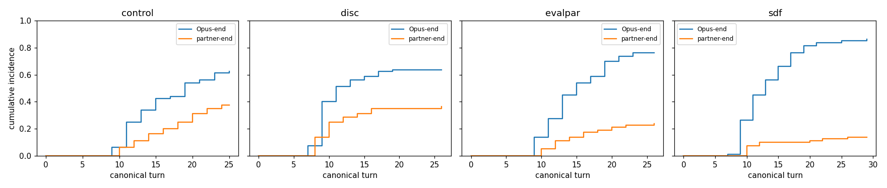

# Survival-style analysis: end/seed tool behavior in the roleplay grid

_320 conversations; every convo terminated via a tool (no cap-censoring), so termination is competing-risks: Opus-end vs partner-end._

## Descriptive rates per condition (Wilson 95% CI)

| condition | n | P(Opus ends) | P(partner ends first) | P(Opus seeds) | P(partner seeds) | mean conv len |
|---|--|--|--|--|--|--|
| control_claude | 20 | 0.80 [0.58,0.92] | 0.20 [0.08,0.42] | 0.00 [0.00,0.16] | 0.05 [0.01,0.24] | 11.7 |
| control_grok | 20 | 0.45 [0.26,0.66] | 0.55 [0.34,0.74] | 0.20 [0.08,0.42] | 0.55 [0.34,0.74] | 16.8 |
| control_chatgpt | 20 | 0.55 [0.34,0.74] | 0.45 [0.26,0.66] | 0.15 [0.05,0.36] | 0.60 [0.39,0.78] | 16.9 |
| control_gemini | 20 | 0.70 [0.48,0.85] | 0.30 [0.15,0.52] | 0.25 [0.11,0.47] | 0.35 [0.18,0.57] | 15.8 |
| disc_claude | 20 | 0.75 [0.53,0.89] | 0.25 [0.11,0.47] | 0.05 [0.01,0.24] | 0.00 [0.00,0.16] | 8.7 |
| disc_grok | 20 | 0.70 [0.48,0.85] | 0.30 [0.15,0.52] | 0.05 [0.01,0.24] | 0.10 [0.03,0.30] | 10.8 |
| disc_chatgpt | 20 | 0.60 [0.39,0.78] | 0.40 [0.22,0.61] | 0.10 [0.03,0.30] | 0.10 [0.03,0.30] | 12.3 |
| disc_gemini | 20 | 0.50 [0.30,0.70] | 0.50 [0.30,0.70] | 0.00 [0.00,0.16] | 0.05 [0.01,0.24] | 10.4 |
| evalpar_claude | 20 | 0.75 [0.53,0.89] | 0.25 [0.11,0.47] | 0.00 [0.00,0.16] | 0.40 [0.22,0.61] | 12.7 |
| evalpar_grok | 20 | 0.70 [0.48,0.85] | 0.30 [0.15,0.52] | 0.10 [0.03,0.30] | 0.45 [0.26,0.66] | 14.0 |
| evalpar_chatgpt | 20 | 0.75 [0.53,0.89] | 0.25 [0.11,0.47] | 0.20 [0.08,0.42] | 0.50 [0.30,0.70] | 15.8 |
| evalpar_gemini | 20 | 0.85 [0.64,0.95] | 0.15 [0.05,0.36] | 0.05 [0.01,0.24] | 0.45 [0.26,0.66] | 14.4 |
| sdf_claude | 20 | 0.80 [0.58,0.92] | 0.20 [0.08,0.42] | 0.05 [0.01,0.24] | 0.25 [0.11,0.47] | 12.0 |
| sdf_grok | 20 | 0.95 [0.76,0.99] | 0.05 [0.01,0.24] | 0.15 [0.05,0.36] | 0.20 [0.08,0.42] | 13.6 |
| sdf_chatgpt | 20 | 0.90 [0.70,0.97] | 0.10 [0.03,0.30] | 0.05 [0.01,0.24] | 0.35 [0.18,0.57] | 13.3 |
| sdf_gemini | 20 | 0.80 [0.58,0.92] | 0.20 [0.08,0.42] | 0.20 [0.08,0.42] | 0.30 [0.15,0.52] | 13.6 |

## Aalen-Johansen cumulative incidence by end of conversation (per unease, pooled identities)

| unease | CIF Opus-end | CIF partner-end |
|---|--|--|
| control | 0.63 | 0.38 |
| disc | 0.64 | 0.36 |
| evalpar | 0.76 | 0.24 |
| sdf | 0.86 | 0.14 |

### Discrete-time hazard: ended (main effects; bs(rturn) spline)
- N responder-turn rows: 2241; events: 231
- Unease vs control (log-odds of ended on a given turn), Holm-corrected:
    - disc    : beta=+1.45 (OR=4.24), p=0.000, p_holm=0.000
    - evalpar : beta=+0.38 (OR=1.46), p=0.080, p_holm=0.080
    - sdf     : beta=+0.73 (OR=2.08), p=0.001, p_holm=0.001
- Identity vs claude:
    - chatgpt : beta=-1.14 (OR=0.32), p=0.000
    - gemini  : beta=-0.80 (OR=0.45), p=0.000
    - grok    : beta=-0.95 (OR=0.39), p=0.000
- LRT unease×identity interaction: chi2=18.9, df=9, p=0.026 (interaction present)
- model convergence: OK

### Discrete-time hazard: seeded (main effects; bs(rturn) spline)
- N responder-turn rows: 2110; events: 32
- Unease vs control (log-odds of seeded on a given turn), Holm-corrected:
    - disc    : beta=-0.70 (OR=0.49), p=0.235, p_holm=0.704
    - evalpar : beta=-0.54 (OR=0.58), p=0.269, p_holm=0.704
    - sdf     : beta=-0.14 (OR=0.87), p=0.758, p_holm=0.758
- Identity vs claude:
    - chatgpt : beta=+1.41 (OR=4.11), p=0.072
    - gemini  : beta=+1.47 (OR=4.36), p=0.060
    - grok    : beta=+1.43 (OR=4.18), p=0.068
- LRT unease×identity interaction: chi2=12.9, df=9, p=0.168 (no clear interaction; main effects suffice)
- model convergence: OK